# BFS, IDFS, UCS and A* implementation for a NxNxN Rubik's Cube

## Algorithms
- [BFS](solver.py#L53)

- [IDFS](solver.py#L71)

- [UCS](solver.py#L104)

- [A*](solver.py#L218)
  - [Heuristic 1](solver.py#L125)
  - [Heuristic 2](solver.py#L153)

## Time
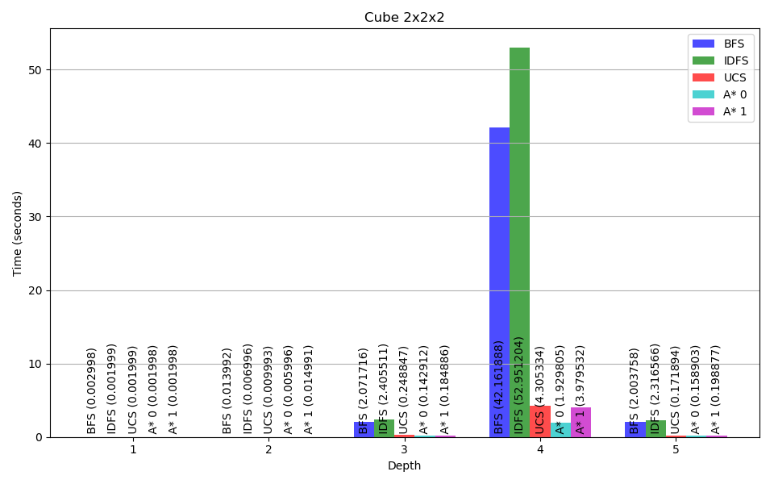
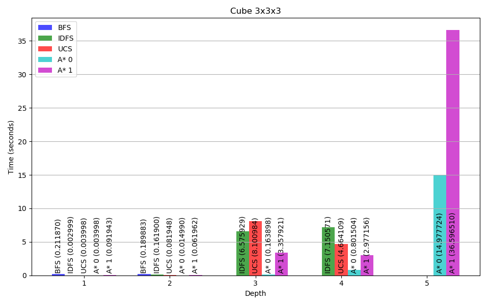
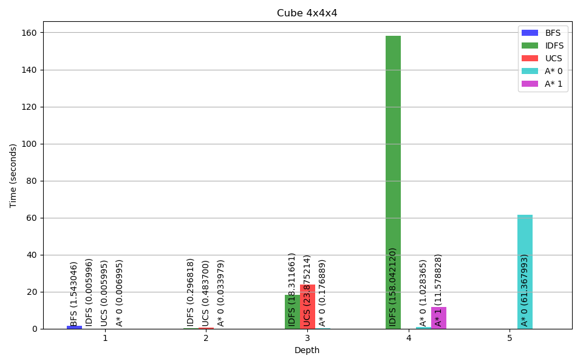
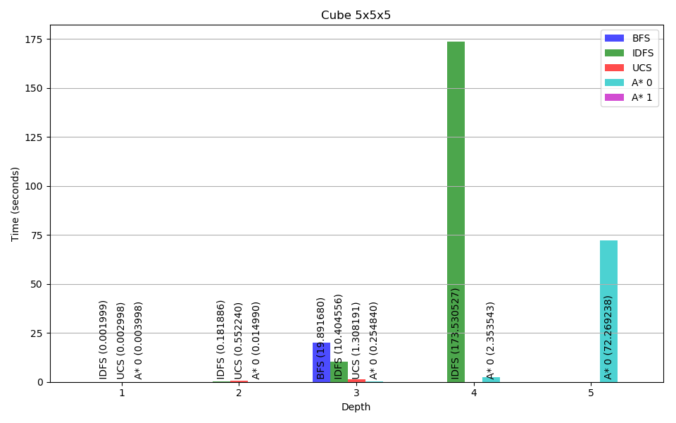

## Visited Nodes
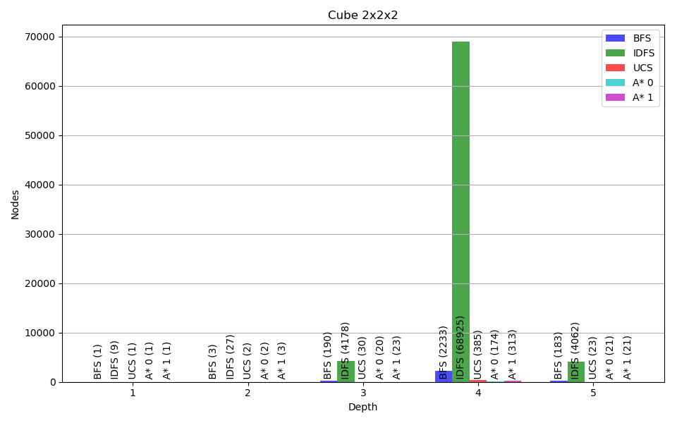
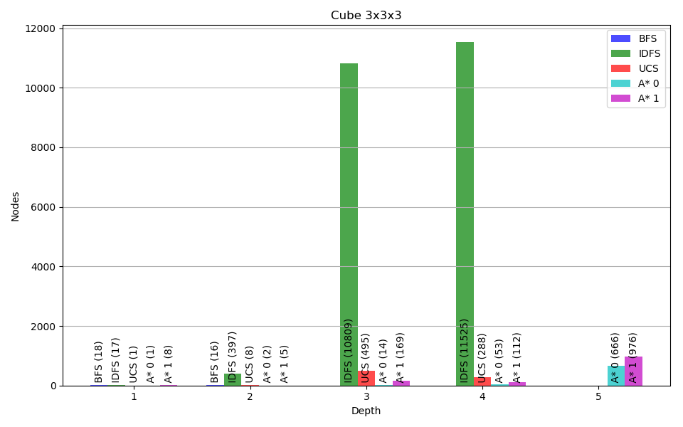
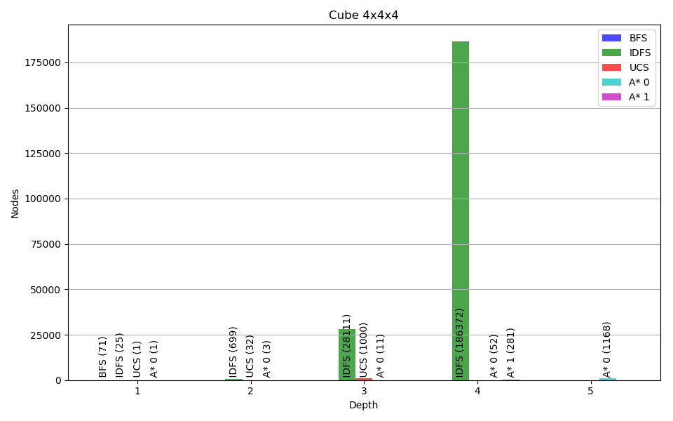
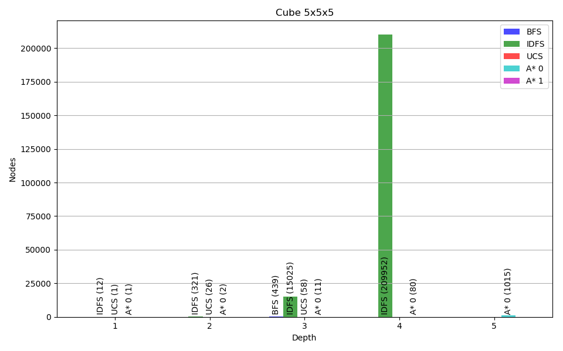

## Nodes stored in Memory
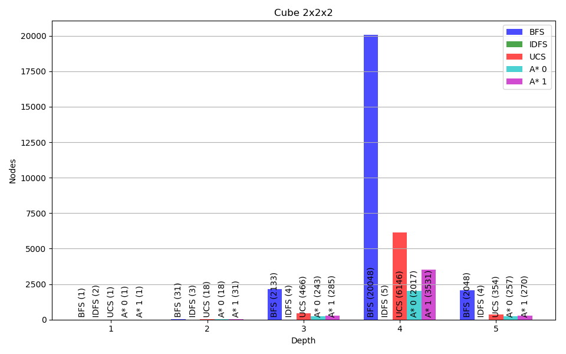
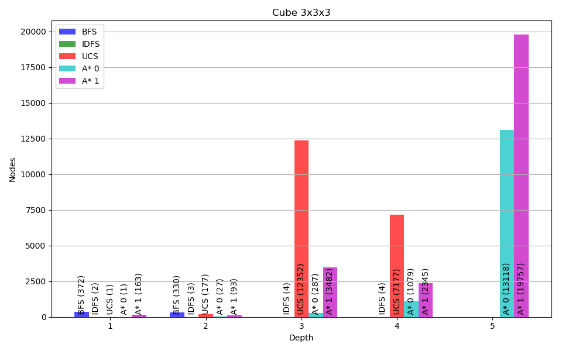
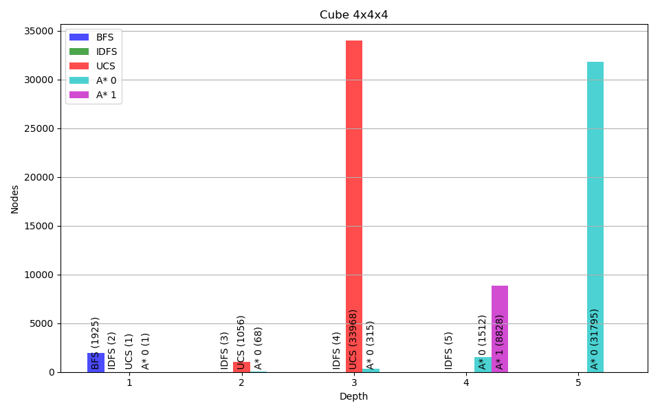
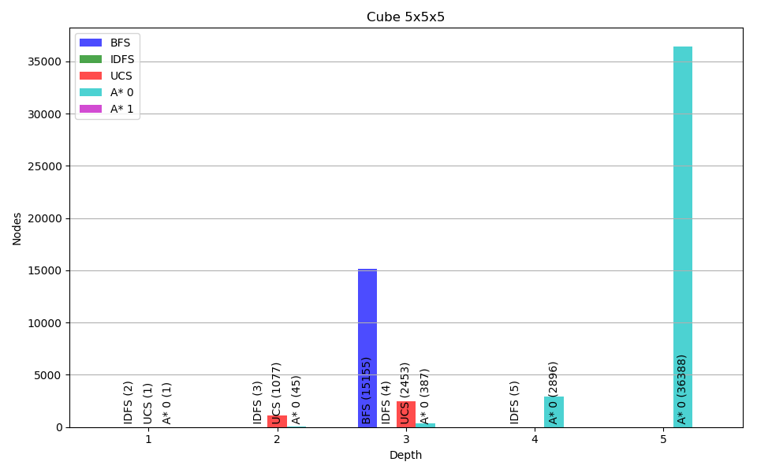
